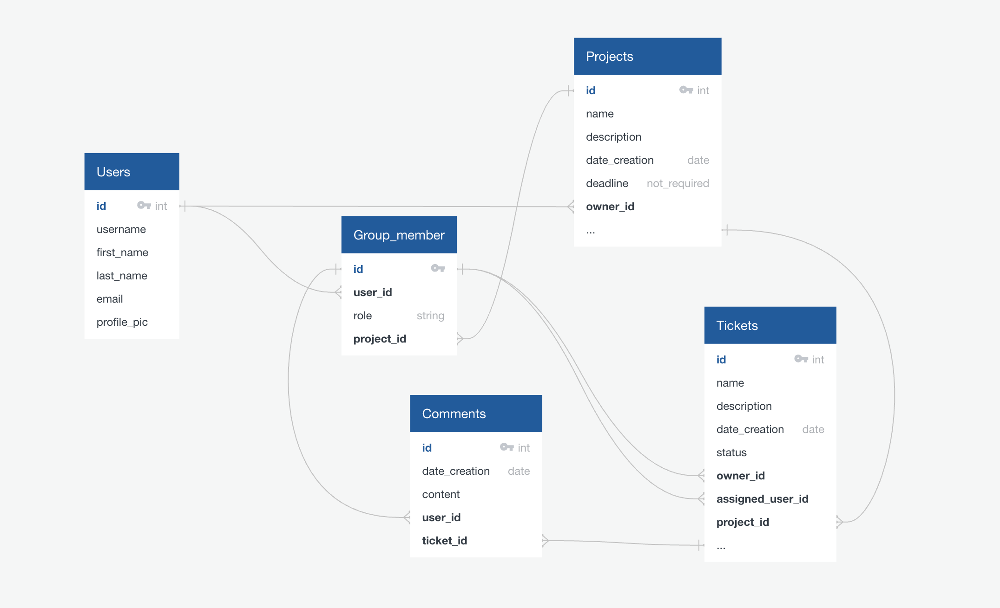
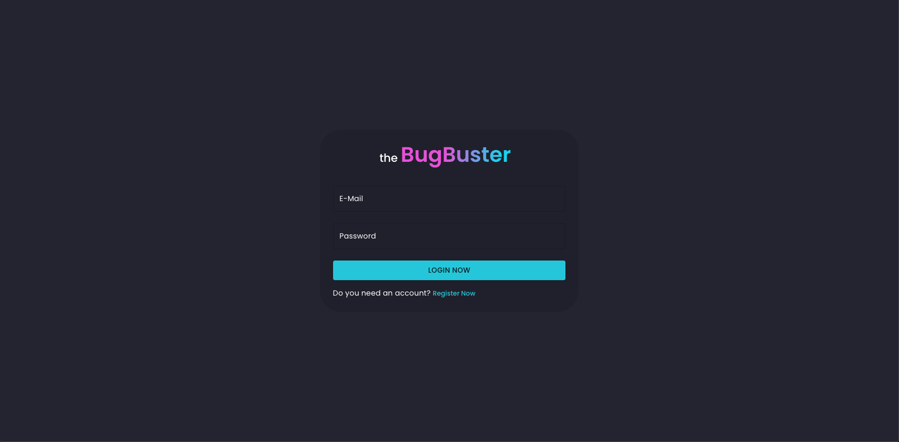
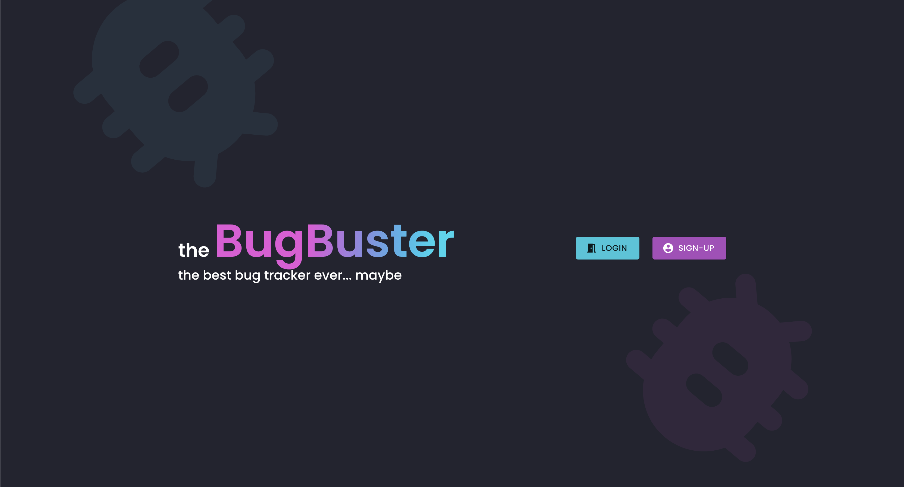
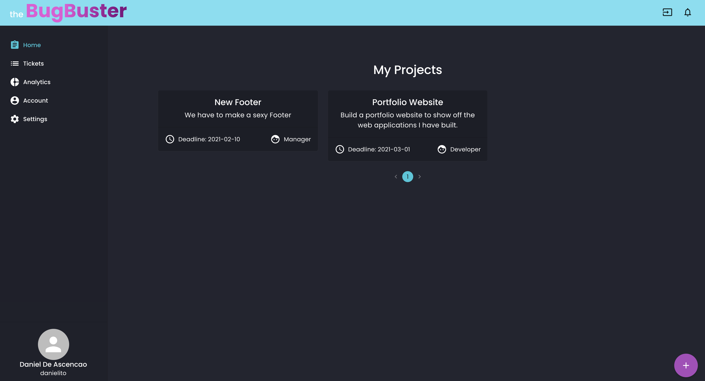
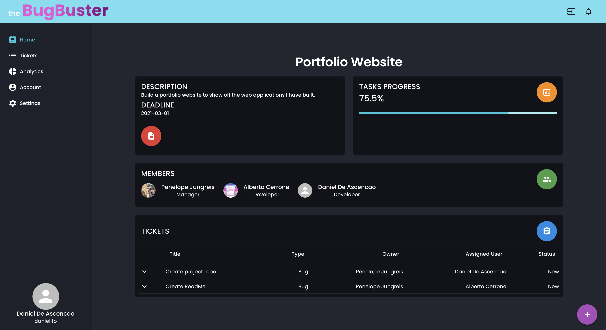
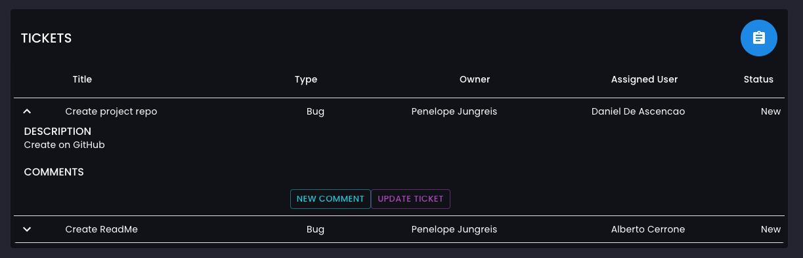
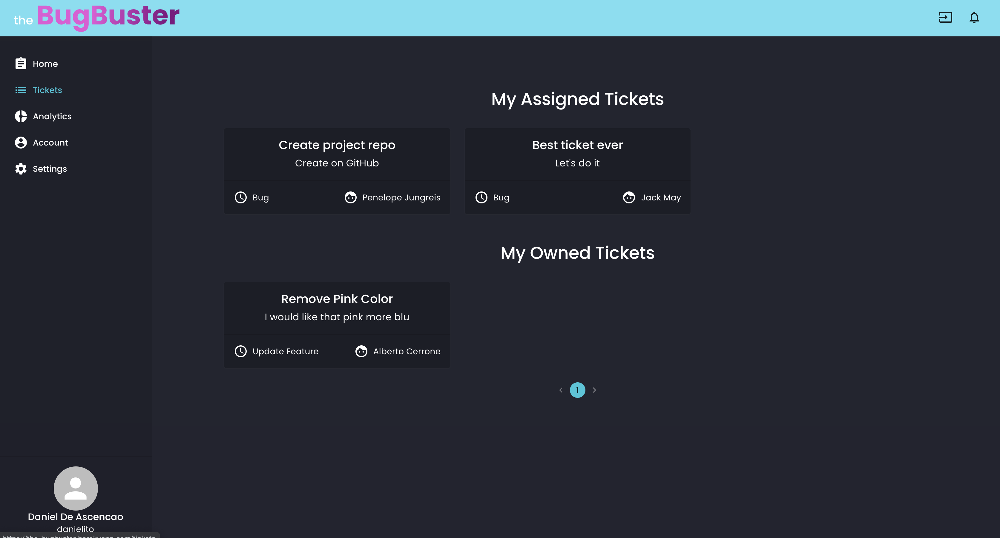
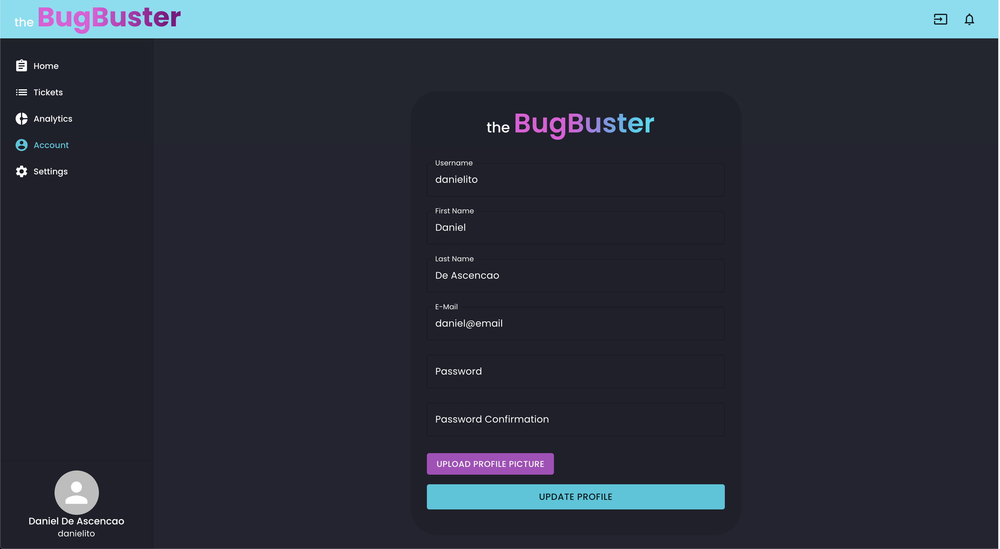
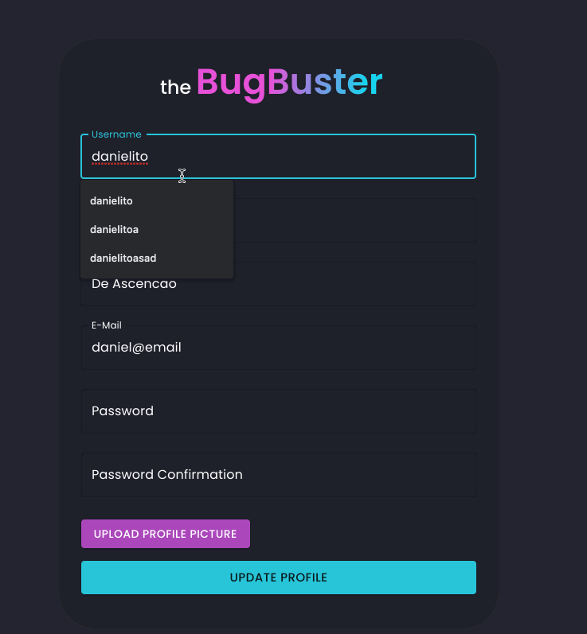

# sei project 4 - BugBuster

## Index
* [Overview](#overview)
* [Installation](#installation)
* [Technologies Used](#technologies-used)
* [Approach](#approach)
  * [Explanations](#explanations)
  * [Thoughts](#thoughts)
* [Conclusion](#conclusion)
	* [Wins and Challenges](#wins-and-challenges)
	* [Some Learnings](#some-learnings)


## Overview 

For my last project at General Assembly's Software Engineering course the task was to develop a full-stack website, this time we had the option to choose between going solo or choosing a duo, I chose the latter and we had a timeframe of 7 days.

In this project we switched the back-end from node to python and used Django to speed up things, for the database we went for PostgreSQL and we stood with React for the front-end.

This project is designed to be a Bug Tracker (sort of a simplified jira) with the basic functionality of it. Every user being able to create a project (or team) and being able to add other users to it with defined roles for that project. Every user being able to have different roles depending on the project, then depending on your role wether or not you can create a ticket, work on it, change the status and close it.

You can register yourself to try the website or you can use the following details to have some data already created
* email: daniel@email
* password: pass

This project is still being worked on by both me and my [duo](https://github.com/albertocerrone)
<!-- 
For my third project in General Assembly's Software Engineering course the task was to, in groups of 3 and in a timeframe of 9 days, develop a full-stack website, making our own back-end using a mongo database and express to handle the data and React for the front-end (using the MERN stack)

For this project we were given green light to choose what we wanted to build, in our case we went for an e-commerce website which after lots of thought and discussing with the team we chose to clone Amazon but Pokémon-themed.

This project was half-way into the course and was the biggest one in terms of time and work, a lot of work was put into it and its still being updated by all the members involved in order to improve some features and fix some details. -->


## Installation

First we need to download the repository into our own machine for which we have to input the following line into our terminal or command line:
```bash 
git clone https://github.com/DanielFDA/sei-project-4.git
```

then we need to make sure both [python](https://www.python.org/downloads/mac-osx/) & [pipenv](https://www.codingforentrepreneurs.com/blog/install-django-on-mac-or-linux) is installed.

Then you'll need to install dependencies in the command line or terminal, making sure you're inside the root of the project. The address on the terminal should look something like this
```bash 
~/GA/development/PROJECTS/sei-project-4
``` 
to install back-end dependencies, in the root of the project (folder) run `pipenv`

then you have to enter the shell for the project: `pipenv shell`

afterwards we have to make migrations for which you run `python manage.py makemigrations`, followed by `python manage.py migrate``

then we need to seed the database by running the following commands one by one in the following order</br>
`python manage.py loaddata jwt_auth/seeds.json`</br>
`python manage.py loaddata projects/seeds.json`</br>
`python manage.py loaddata group_members/seeds.json`</br>
`python manage.py loaddata tickets/seeds.json`</br>
`python manage.py loaddata comments/seeds.json`

now we can start the back-end: `python manage.py runserver`

then we are only missing 2 steps, 1. Install dependencies for the front-end for which we: 
```bash 
cd client && yarn
``` 
and 2. start the front-end: `yarn start`.

## Technologies Used
* CSS
* JavaScript (ES6)
* HTML5
* PostgreSQL
* Python
* Django
* Material-UI
* React
* Insomnia
* Trello
* GitHub
* Git
* Heroku
* Google Sheets
* VSCode

## Approach

For this project I was working with [Alberto](https://github.com/albertocerrone).

The first thing we discussed after deciding for a bug tracker app was how we wanted to make it and what framework we wanted to use to style it, because we had green light to choose it as we liked. In this instance we went for Material UI because Alberto had a strong interest in using it and getting more confident with it (he had previously used it throughout the course), for this I had no objection because I had heard about it and also wanted to see how it went, even thought Alberto worked most of the styling I got to play around with some things and also by watching the code after it was styled I got to understand a lot of how Material UI works and for this I thank Alberto cuz I learned more than I thought I would about it.

### Explanations

After deciding this we had to start working on the database diagram to get signed off on the project.

After lots of inputs from both Alberto, the Instructors and me, the diagram looked like this:

<p align="center" width="100%">
     
</p>

This meant that every user would be able to create a project while also being part of other projects, the user would become a group_member when joining or creating a project and would have a stablished role as group_member depending on the project, then we agreed that depending on the role of the user there was going to be limitations for what they could or couldn't do, for example a manager could do everything a developer could but they could also create, review and close tickets. Developers could only work on and update tickets, they could also make comments on them (this feature wasn't completely implemented due to lack of time).

The diagram gave us a complex but big scope to be able to make the site as we wanted it, but would later prove to complicate some things a little more than needed. Even then we both agreed that it was the right way to do it because we can keep working and adding stuff on this site, thanks to having a robust back-end that allows us to create lots of functionality.

After being signed off we started working on the backend where we both agreed that the both of us wanted to work on (mainly because in both of our cases, in our previous project we worked front-end, so we wanted to make sure that we were capable of doing the back-end parts of coding as well). So we began by creating the models and the basic relationships needed, heres some of them.

```py
class User(AbstractUser):
    username = models.CharField(max_length=30, unique=True)
    first_name = models.CharField(max_length=40)
    last_name = models.CharField(max_length=50)
    email = models.CharField(max_length=50, unique=True)
    profile_image = models.CharField(max_length=1000)
```

```py
class GroupMember(models.Model):

    manager = "Manager"
    developer = "Developer"
    roles = [
        (manager, "Manager"),
        (developer, "Developer"),
    ]

    role = models.CharField(
        max_length=15,
        choices=roles,
        default=developer,
    )
    user = models.ForeignKey(
        "jwt_auth.User",
        related_name="group",
        on_delete=models.DO_NOTHING,
    )
    project = models.ForeignKey(
        "projects.Project",
        related_name="members",
        on_delete=models.CASCADE,
    )
```

```py 
class Project(models.Model):
    name = models.CharField(max_length=30, unique=True)
    description = models.TextField(max_length=250)
    creation_date = models.DateTimeField(auto_now_add=True)
    deadline = models.DateField()
    owner = models.ForeignKey(
        "jwt_auth.User",
        related_name="created_project",
        on_delete=models.CASCADE,
    )
```

```py
class Ticket(models.Model):
    BUG = "Bug"
    NEW_FEATURE = "New Feature"
    UPDATE_FEATURE = "Update Feature"
    DELETE_FEATURE = "Delete Feature"
    types_of_tickets = [
        (BUG, "Bug"),
        (NEW_FEATURE, "New Feature"),
        (UPDATE_FEATURE, "Update Feature"),
        (DELETE_FEATURE, "Delete Feature"),
    ]
    NEW = "New"
    IN_PROGRESS = "In Progress"
    FEEDBACK = "FeedBack"
    BLOCKED = "Blocked"
    RESOLVED = "Resolved"
    tickets_status = [
        (NEW, "New"),
        (IN_PROGRESS, "In Progress"),
        (FEEDBACK, "Feedback"),
        (BLOCKED, "Blocked"),
        (RESOLVED, "Resolved"),
    ]
    title = models.CharField(max_length=70)
    types = models.CharField(
        max_length=14,
        choices=types_of_tickets,
        default=BUG,
    )
    description = models.TextField(max_length=300)
    creation_date = models.DateTimeField(auto_now_add=True)
    status = models.CharField(
        max_length=15,
        choices=tickets_status,
        default=NEW,
        blank=True,
    )
    owner = models.ForeignKey(
        "group_members.GroupMember",
        related_name="created_tickets",
        on_delete=models.DO_NOTHING,
    )
    user_owner = models.ForeignKey(
        "jwt_auth.User",
        related_name="created_tickets",
        on_delete=models.DO_NOTHING,
    )
    project = models.ForeignKey(
        "projects.Project",
        related_name="tickets",
        on_delete=models.CASCADE,
    )
    assigned_user = models.ForeignKey(
        "group_members.GroupMember",
        related_name="tickets",
        on_delete=models.DO_NOTHING,
    )
```

After these were set up and connected we needed the views to be able to get, create, update and delete information.

These are long because we needed multiple in order to access all the data so I'm not going to show each specific one, I'll use the user views for this example.

```py
class RegisterView(APIView):
    """ Controller for post request to /auth/register """

    def post(self, request):
        user_to_create = UserSerializer(data=request.data)
        if user_to_create.is_valid():
            user_to_create.save()
            return Response(
                {"message": "Registration Successful"}, status=status.HTTP_201_CREATED
            )
        return Response(
            user_to_create.errors, status=status.HTTP_422_UNPROCESSABLE_ENTITY
        )


class LoginView(APIView):

    """ Controller for post request to /auth/login """

    def post(self, request):
        email = request.data.get("email")
        password = request.data.get("password")
        try:
            user_to_login = User.objects.get(email=email)
        except User.DoesNotExist:
            raise PermissionDenied(detail="Invalid Credentials")
        if not user_to_login.check_password(password):
            raise PermissionDenied(detail="Invalid Credentials")
        expiry_time = datetime.now() + timedelta(days=7)
        token = jwt.encode(
            {"sub": user_to_login.id, "exp": int(expiry_time.strftime("%s"))},
            settings.SECRET_KEY,
            algorithm="HS256",
        )
        return Response(
            {"token": token, "message": f"Welcome Back {user_to_login.username}"}
        )


class ProfileView(APIView):
    def get_user(self, pk):
        """ returns user from db by its pk(id) or responds 404 not found """
        try:
            return User.objects.get(pk=pk)
        except User.DoesNotExist:
            raise NotFound()

    permission_classes = (IsAuthenticated,)

    def get(self, request):
        user = User.objects.get(pk=request.user.id)
        serialized_user = PopulatedUserSerializer(user)
        return Response(serialized_user.data, status=status.HTTP_200_OK)

    def put(self, request):
        user_to_update = self.get_user(pk=request.user.id)
        if user_to_update.id != request.user.id:
            raise PermissionDenied()
        updated_user = UserSerializer(user_to_update, data=request.data)
        if updated_user.is_valid():
            updated_user.save()
            return Response(updated_user.data, status=status.HTTP_202_ACCEPTED)
        return Response(
            updated_user.errors, status=status.HTTP_422_UNPROCESSABLE_ENTITY
        )


class ProfileListView(APIView):
    def get(self, _request):
        users = User.objects.all()
        serialized_user = UserSerializer(users, many=True)
        return Response(serialized_user.data, status=status.HTTP_200_OK)


class ProfileDetailView(APIView):
    def get_user(self, pk):
        """ returns user from db by its pk(id) or responds 404 not found """
        try:
            return User.objects.get(pk=pk)
        except User.DoesNotExist:
            raise NotFound()

    def get(self, _request, pk):
        user = self.get_user(pk=pk)
        serialized_user = UserSerializer(user)
        return Response(serialized_user.data, status=status.HTTP_200_OK)
```

Here you can the first view is RegisterView, what this one does is create a user if all the fields that are in the model are correctly inputed.

For the LoginView we have a post request to login with the credentials previously created, if the user exists and the credentials are valid it will set a token to that account with a expiry time of 7 days, this token can then be used to make control flow in both the back-end and front-end for the user, limiting what they can or can't do/see.

Next we have the ProfileViews, we have a get requests to get information about the logged in user, then we have an update view that will run the information inputted and check if its valid (also if its different from the one that alredy exists) and if the person updating is the same one that its being updated, if its all good it will update that account.

Last we have the ProfileListView and the ProfileDetailView, the ListView to show all the users in the db, and the DetailView to show a specific user by id, all of this with the objective of being able to perform all the requests that we need to get the front-end running and being able to implement all the features that we wanted.

After setting up the back-end and doing some of the relationships we had to start the build the front-end for which inevitably we had to split, leaving Alberto to keep working on the back-end for a couple days and me to start setting up the front-end and adding some features.

For this app you have to register/login in order to access it, to start with we set up the basic jsx and logic for the forms in both the register/login pages.

```js
<form onSubmit={handleSubmit} className={classes.form}>
  <Box mb={3} style={{ marginLeft: '20%' }}>
    <Typography
      color="textSecondary"
      gutterBottom
      variant="h3"
    >
      the <span className={classes.logo}>BugBuster</span>
    </Typography>
  </Box>

  <TextField
    error={(errors.email)}
    fullWidth
    label="E-Mail"
    margin="normal"
    name="email"
    onChange={handleChange}
    value={formdata.email}
    variant="outlined"
  />
  <TextField
    error={Boolean(errors.password)}
    fullWidth
    helperText={errors.detail}
    label="Password"
    margin="normal"
    name="password"
    onChange={handleChange}
    value={formdata.password}
    variant="outlined"
    type="password"
  />
  <Box my={2}>
    <Button
      color="primary"
      fullWidth
      size="large"
      type="submit"
      variant="contained"
    >
      Login now
    </Button>
  </Box>
  <Typography
    color="textSecondary"
    variant="body1"
  >
    Do you need an account?
    {' '}
    <Link
      component={RouterLink}
      to="/register"
      variant="h6"
    >
      Register Now
    </Link>
  </Typography>
</form>
```

And for the logic.

```js
  const history = useHistory()
  const { formdata, errors, handleChange, setErrors } = useForm({
    email: '',
    password: ''
  })

  const handleSubmit = async (e) => {
    e.preventDefault()

    try {
      const { data } = await loginUser(formdata)
      setToken(data.token)

      setTimeout(() => {
        history.push('/home')
      }, 500)
    } catch (err) {
      const errorobj = {
        email: err.response.data.detail,
        password: err.response.data.detail
      }
      setErrors(errorobj)
      // //console.log('err.response.data: ', err.response.data)
      // //console.log('Errors: ', errors)
    }
  }
```

All the credit from this custom Hook goes to the Instructor of my course at GA [Jack-May](https://github.com/Jack11709).

What this did was make a post request with the details inputted into the formdata and make use of a custom hook useForm.

```js
function useForm(intialState) {
  const [formdata, setFormdata] = React.useState(intialState)
  const [errors, setErrors] = React.useState(intialState)


  const handleChange = (e) => {
    const value = e.target.type === 'checkbox' ? e.target.checked :
      e.target.value
    const nextState = { ...formdata, [e.target.name]: value }
    const nextErrorState = { ...errors, [e.target.name]: '' }
    setFormdata(nextState)
    setErrors(nextErrorState)
    //console.log(e.target.name)
  }


  return {
    formdata,
    errors,
    handleChange,
    setFormdata,
    setErrors
  }
}
```

This hook takes care of setting to state the values being inputted by the user in the form and also the errors that may come up.

Then if it was succesful it would use the function setToken.

```js
export function setToken(token) {
  window.localStorage.setItem('token', token)
}
```

to store in the browser the token coming from the back-end, then it would push the user to the home page, after a 0.5s delay. If any of the credentials was invalid it would just pop the errors in the screen instead.

The error handling for this page was automatically done by Django, all we did was display the errors that Django would throw in case of invalid credentials.

This is how it ended up looking after all the styling done by my partner.

<p align="center" width="100%">
     
</p>

For the register page pretty much the same, except that this page has no actual error handling, what it does is just show a message in case you leave a field blank. I didn't have time to improve this.

```js
<form onSubmit={handleSubmit} className={classes.form}>
  <Box mb={3} style={{ marginLeft: '20%' }}>
    <Typography
      color="textSecondary"
      gutterBottom
      variant="h3"
    >
      the <span className={classes.logo}>BugBuster</span>
    </Typography>
  </Box>
  <TextField
    error={Boolean(errors.username)}
    fullWidth
    helperText={errors.username}
    label="Username"
    margin="normal"
    name="username"
    onChange={handleChange}
    value={formdata.username}
    variant="outlined"
  />
  <TextField
    error={Boolean(errors.firstName)}
    fullWidth
    helperText={errors.firstName}
    label="First Name"
    margin="normal"
    name="firstName"
    onChange={handleChange}
    value={formdata.firstName}
    variant="outlined"
  />
  <TextField
    error={Boolean(errors.lastName)}
    fullWidth
    helperText={errors.lastName}
    label="Last Name"
    margin="normal"
    name="lastName"
    onChange={handleChange}
    value={formdata.lastName}
    variant="outlined"
  />
  <TextField
    error={Boolean(errors.email)}
    fullWidth
    helperText={errors.email}
    label="E-Mail"
    margin="normal"
    name="email"
    onChange={handleChange}
    value={formdata.email}
    variant="outlined"
  />
  <TextField
    error={Boolean(errors.password)}
    fullWidth
    helperText={errors.password}
    label="Password"
    margin="normal"
    name="password"
    onChange={handleChange}
    value={formdata.password}
    variant="outlined"
    type="password"
  />
  <TextField
    error={Boolean(errors.passwordConfirmation)}
    fullWidth
    helperText={errors.passwordConfirmation}
    label="Password Confirmation"
    margin="normal"
    name="passwordConfirmation"
    onChange={handleChange}
    value={formdata.passwordConfirmation}
    variant="outlined"
    type="password"
  />
  <div>
    <ImageUpload
      value={formdata.profile_image}
      name="profile_image"
      buttonText='Upload Profile Picture'
      onChange={handleChange}
    />
    <p>{errors.profileImage}</p>
  </div>
  <Box my={2}>
    <Button
      color="primary"
      fullWidth
      size="large"
      type="submit"
      variant="contained"
    >
      Sign up now
    </Button>
  </Box>
  <Typography
    color="textSecondary"
    variant="body1"
  >
    Have an account?
    {' '}
    <Link
      component={RouterLink}
      to="/login"
      variant="h6"
    >
      Sign in
    </Link>
  </Typography>
</form>
```

And for the logic.

```js
  const { formdata, errors, handleChange, setErrors } = useForm({
    username: '',
    email: '',
    password: '',
    passwordConfirmation: '',
    profileImage: '',
    firstName: '',
    lastName: ''
  })

  const handleSubmit = async (e) => {
    e.preventDefault()

    try {
      const response = await registerUser(formdata)
      // //console.log(response)
      
      setTimeout(() => {
        history.push('/login')
      }, 500)
    } catch (err) {
      // //console.log(err.response.data)
      setErrors(err.response.data)
    }
  }
```

Again using the custom hook useForm to set to state all the inputs and the errors.

Then just making a post request to register an user with the inputted information and push this user to the login page if it is succesful, after 0.5s. If not succesful it would just display the error messages.

This was the landing page where you got the option to Login or Register.

<p align="center" width="100%">
     
</p>

After login in, this was the home page.

<p align="center" width="100%">
     
</p>

As you can see on the left you have the nav-bar to navigate through the site, some of the features included in the nav-bar are not yet developed like the analytics and settings page.

In the home page you can see the index page for the projects and here you have the projects that you own or are part of, with the role you have for that project, if you create a project you automatically become a manager for it.

You can click on a project to go to the show page of that project with more detailed information.

<p align="center" width="100%">
     
</p>

Here you can see all the information about the project and all the tickets that have been created in it with their information as well, you can choose to reveal more information about a ticket if you want by clicky on the arrow. 

<p align="center" width="100%">
     
</p>

Then on the tickets tab.

<p align="center" width="100%">
     
</p>

Here you can see the index page for the tickets which shows you the tickets that are assigned to you and the tickets that you created.

Lastly we have the Account page, that is designed to be a form in which you can update the information of your account if you so wish to do so.

<p align="center" width="100%">
     
</p>

All you have to do is change the information that you want and input your password and password confirmation and the page will send a put request to the API in order to update it. 

<p align="center" width="100%">
     
</p>

### Thoughts

This project was great all-around, the fact that we both got to work and understand the back-end meant a lot for our learning and having developed what I consider a good back-end to be easily utilized by the front-end and to grand extent allows us to add a lot of features and functionality that we didn't have the chance to add while on the course.

Working with Alberto was really great, since before we decided to pair for this project we were already good friends and hopefully we will be staying in touch after the course ends as well.
## Conclusion

### Wins and Challenges

Most of the wins for this project revolved around learning lots of different things like Material-UI which Alberto had a special interest for using, learning Python as we had just learned the basics and we were learning more as we went and developing more complex functions to deal with the logic we wanted to implement in order to achieve all the relationships shown in our diagram.

The diagram was very tricky but useful for a lot of things we had set out to do like being able to change roles depending on the project, this complexity played a huge role, limiting the amount of features that we were able to implement but it's something that we both agreed on mainly because the scope is very big but we alredy have done the back-end side of things which is the most complicated part and now we can focus on improving what we alredy made and add features that we wanted to have.

<!-- The biggest win for me was learning how to work as a team, not only communicating efficiently, being on the same page and sharing a common goal but also learning to use git commands and getting more used to sharing thoughts about ongoing work and to-be added features.

The biggest challenges I encountered were mainly code related, stuff that I wanted to implement but had to research and try to do it and sometimes having to ask for help because time was of the essence, which helped me learn a lot of new stuff and kept us as a cohesive team.  -->


### Some Learnings

Using Django made us realize how impactful a technologie can be, mainly because with Django there's a lot stuff that's alredy made and implemented without having to do anything, where as with mongo you have to set everything up from scratch, this can be both very useful and frustating (in case you want to edit or make your own customized validations for example.) but it will always depend on the project, how complex, how much time and manpower there is for it. Showing us that choosing a technologie in the beggining of a project is a very useful tool, and being versatile will most often than not help you/your team, develop a much more stable and efficient app.

Once again I had the luck of having a teammate that was very enjoyable to work with and that made the experience of developing this project one to remember going forward. We are both very proud of what we did and we look forward to working with each other in the future.
<!-- 
This being the biggest project I worked on during the course meant that it's the one where I learned the most about the front-end side of things which is where I spent the majority of my time.

Being up to date with our daily standups and meeting played a big role in order for me to be aware of how things were working in the back-end side of things (in case they changed from one day to another) and made everything go smoother coding wise, also teached me a lot about how and what to communicate in order for the best approach to be taken about a certain matter.

This being the first time working on a full-stack app meant that the beggining was very tough, having to set up everything and being able to run it in all of our computers and update with regular commits so we could see the improvements of everyone involved was a huge learning process that was well worth it in the end because we all felt very comfortable using git at the end of it.

All the process that took part in this project was very unique and special, we were very ambitious with the amount of functionality we wanted for the website but at the same time everyone was working very hard to achieve everything that we set up to do, due to the amount of work some of the features weren't completely polished and had to be left out of the deployed website but I feel like my teammates and I are very happy about the outcome of this project and I'm certainly very grateful of being part of it, it was a tiring but very enjoyable experience. -->

<!-- 
[Index](#index) -->